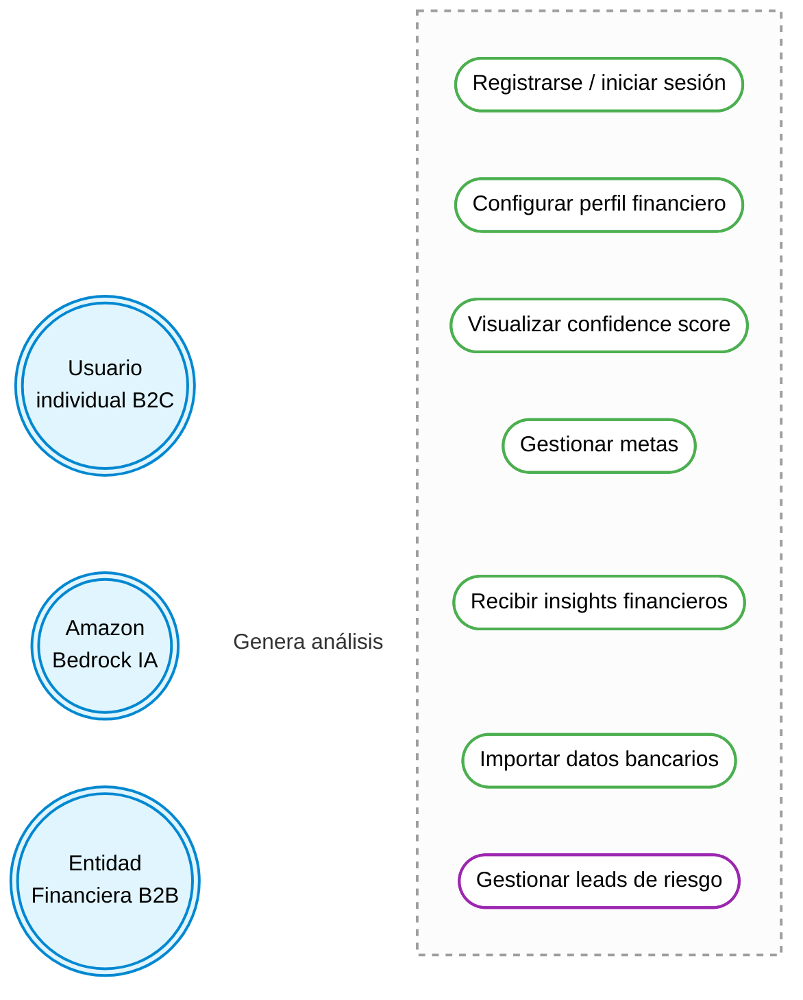
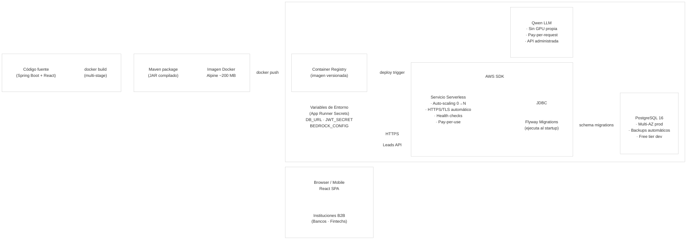

# FinWise — B2B2C Financial Intelligence Platform

> **Stack:** Spring Boot 3.2 / Java 17 / PostgreSQL 16 / React.js / AWS App Runner / Amazon Bedrock (Qwen)
> **Version:** 1.0 — MVP Hackathon · Abril 2026

---

## Tabla de Contenidos

1. [Diagrama de Casos de Uso](#1-diagrama-de-casos-de-uso)
2. [Diagrama de Componentes](#2-diagrama-de-componentes)
3. [Diagrama de Despliegue](#3-diagrama-de-despliegue)
4. [Decisiones Arquitectónicas (ADRs)](#4-decisiones-arquitectónicas-adrs)
5. [Mejoras Futuras y Alineación con los ODS](#5-mejoras-futuras-y-alineación-con-los-ods)

---

## 1. Diagrama de Casos de Uso

Muestra las interacciones entre los tres actores del sistema y los casos de uso de la plataforma. El usuario B2C accede a las funcionalidades de bienestar financiero; la entidad financiera B2B consume los leads calificados; Amazon Bedrock genera el análisis de insights de forma automática.



---

## 2. Diagrama de Componentes

Arquitectura monolítica por capas (*Layered Monolith*) con separación estricta de responsabilidades. El frontend React consume la API REST protegida por JWT; el backend delega la persistencia a RDS y la inteligencia a Amazon Bedrock.

```mermaid
%%{init: {"theme": "base", "themeVariables": {"background": "#ffffff00", "primaryColor": "#ffffff00", "secondaryColor": "#ffffff00", "tertiaryColor": "#ffffff00", "clusterBkg": "#ffffff00", "clusterBorder": "#cccccc"}}}%%
graph TB
    subgraph CLIENT["🖥️  Cliente"]
        SPA["React.js SPA (Vite)\nRedux Toolkit · React Query"]
    end

    subgraph APPRUNNER["☁️  AWS App Runner — Spring Boot 3.2 / Java 17"]

        subgraph LAYER_SEC["Capa de Seguridad"]
            SEC["Spring Security + JWT\nBCrypt · Stateless"]
        end

        subgraph LAYER_CTRL["Capa de Controladores"]
            direction LR
            C1["AuthController"]
            C2["DashboardController"]
            C3["InsightsController"]
            C4["GoalController"]
            C5["TransactionController"]
        end

        subgraph LAYER_SVC["Capa de Servicios (Lógica de Negocio)"]
            direction LR
            S1["AuthService"]
            S2["DataGenService"]
            S3["CashflowService"]
            S4["ScoreService"]
            S5["LeadService"]
            S6["InsightsService\n(cache semanal)"]
            S7["GoalService"]
        end

        subgraph LAYER_REPO["Capa de Repositorios (JPA)"]
            direction LR
            R1["UserRepository"]
            R2["AccountRepository"]
            R3["TransactionRepository"]
            R4["CashflowSnapshotRepository"]
            R5["UserScoreRepository"]
            R6["LeadRepository"]
            R7["GoalRepository"]
            R8["InsightRepository"]
        end

        subgraph LAYER_CFG["Configuración Transversal"]
            direction LR
            CFG1["SecurityConfig"]
            CFG2["CorsConfig"]
            CFG3["SwaggerConfig"]
            CFG4["GlobalExceptionHandler"]
        end

    end

    subgraph DATA["🗄️  Amazon RDS — PostgreSQL 16"]
        DB[("PostgreSQL\nusers · accounts · debts\ntransactions · cashflow_snapshots\nuser_scores · leads · goals\nuser_insights")]
    end

    subgraph AI["🤖  Amazon Bedrock"]
        BEDROCK["Modelo Qwen\nAnálisis financiero\npersonalizado en español"]
    end

    SPA -- "HTTPS / REST + JWT" --> SEC
    SEC --> LAYER_CTRL
    LAYER_CTRL --> LAYER_SVC
    LAYER_SVC --> LAYER_REPO
    LAYER_REPO -- "JDBC / JPA (Flyway migrations)" --> DB
    S6 -- "AWS SDK · Invoke Model" --> BEDROCK
```

---

## 3. Diagrama de Despliegue

El flujo de CI/CD es 100% basado en contenedores. Un `docker build` multi-stage produce una imagen Alpine de ~200 MB que se publica en ECR y AWS App Runner la sirve como servicio serverless con HTTPS automático.



---

## 4. Decisiones Arquitectónicas (ADRs)

### ADR-001 · Arquitectura Serverless con AWS App Runner

| | |
|---|---|
| **Estado** | Aceptado |
| **Contexto** | El equipo necesita un entorno de producción funcional para el hackathon con costo mínimo, HTTPS automático y cero administración de servidores. |
| **Decisión** | Usar **AWS App Runner** con imágenes Docker en ECR como plataforma de despliegue. |
| **Justificación** | App Runner provee auto-scaling de 0 a N instancias, TLS automático, health checks integrados y deploy directo desde ECR. El costo estimado para el MVP es **< $5 USD**, eliminando la necesidad de configurar EC2, Load Balancers o Kubernetes. Es la opción óptima cuando el equipo es pequeño y el tiempo de entrega es el recurso más escaso. |
| **Consecuencias** | Cold starts posibles en baja carga; aceptable para hackathon. En producción escalonada se evaluaría Fargate o EKS. |

---

### ADR-002 · Spring Boot 3.2 / Java 17 como backend

| | |
|---|---|
| **Estado** | Aceptado |
| **Contexto** | El equipo evaluó Node.js/Express y Spring Boot para construir la API REST. |
| **Decisión** | Usar **Spring Boot 3.2 con Java 17**. |
| **Justificación** | Spring Boot provee Spring Security con JWT out-of-the-box, Flyway para migraciones versionadas, Spring Data JPA para repositorios tipados, y SpringDoc/Swagger para documentación automática. La tipificación estricta de Java reduce errores en lógica financiera crítica (scoring, cálculos de cashflow). Adicionalmente, es el stack predominante en el mercado laboral fintech mexicano, lo que facilita la incorporación de nuevos colaboradores. |
| **Consecuencias** | Mayor verbosidad que Node.js; compensada por robustez, ecosistema maduro y ausencia de errores de tipo en runtime. |

---

### ADR-003 · Amazon Bedrock + Qwen para IA financiera

| | |
|---|---|
| **Estado** | Aceptado |
| **Contexto** | El producto requiere análisis financiero personalizado en español con datos reales del usuario. Se evaluaron: LLM propio (GPU), OpenAI API, y Amazon Bedrock. |
| **Decisión** | Usar **Amazon Bedrock con el modelo Qwen**. |
| **Justificación** | Bedrock es un servicio administrado que elimina la necesidad de infraestructura GPU (costosa e inoperante para un MVP). El modelo Qwen tiene buen rendimiento en español, alineado con el mercado objetivo mexicano. La integración es nativa dentro del ecosistema AWS, simplificando IAM y networking. El **cache semanal** (`UNIQUE user_id + week_start`) garantiza que el costo por usuario sea prácticamente nulo después de la primera llamada semanal. |
| **Consecuencias** | Latencia de 2-5s en la primera carga semanal; las siguientes son instantáneas desde BD. Dependencia del ecosistema AWS. |

---

### ADR-004 · Modelo de Monetización B2B2C con `credit_intent` como opt-in

| | |
|---|---|
| **Estado** | Aceptado |
| **Contexto** | El producto es gratuito para el usuario final. Se requiere un modelo de monetización sostenible sin alienar al usuario con publicidad o cobros. |
| **Decisión** | Monetizar mediante **venta de leads calificados a instituciones financieras**, controlada por el flag `credit_intent` como opt-in explícito del usuario. |
| **Justificación** | El usuario activa voluntariamente `credit_intent = TRUE` para recibir ofertas financieras. Solo usuarios con `score ≥ 70` generan un `lead`, garantizando calidad para el B2B. Los datos transaccionales verificados elevan la tasa de conversión muy por encima de los leads de formulario genérico (conversión industria < 2%). Esto crea un modelo win-win: usuario recibe bienestar financiero gratuito; institución recibe leads de alta calidad; FinWise monetiza la diferencia. La privacidad queda protegida mediante el `user_id_anon` en la tabla `leads`. |
| **Consecuencias** | La tasa de activación de `credit_intent` es una métrica crítica del negocio. Requiere comunicación clara al usuario sobre el uso de sus datos. |

---

## 5. Mejoras Futuras y Alineación con los ODS

### Mejoras Técnicas para Escalar el MVP

**Mejora 1 — Integración con Open Banking (NESI / CNBV)**
Los campos `nesi_customer_id` y `nesi_account_id` en la tabla `users` son los puntos de extensión ya diseñados para esta integración. Conectar FinWise al estándar de Open Banking mexicano (regulado por la CNBV) permitirá sincronización automática y en tiempo real de transacciones bancarias reales, reemplazando los datos generados y elevando la precisión del Confidence Score de indicativo a crediticio. Arquitectónicamente, implicará un microservicio de sincronización asíncrona con colas SQS y un job scheduler (Spring Batch).

**Mejora 2 — Pipeline de ML propio para Scoring Crediticio**
El Confidence Score actual (fórmula `50 + L + A - (D*5)`) es transparente y auditable, ideal para el MVP. A futuro, el historial acumulado en `user_scores` y `cashflow_snapshots` constituye un dataset de entrenamiento propio para un modelo de Machine Learning (XGBoost o red neuronal ligera) desplegado en Amazon SageMaker. Esto permitirá capturar patrones no lineales de comportamiento financiero, mejorando la calidad de los leads B2B y abriendo la posibilidad de un score crediticio alternativo al Buró de Crédito.

**Mejora 3 — Arquitectura de Microservicios con Event-Driven Design**
El monolito por capas es la decisión correcta para el hackathon, pero al escalar a decenas de miles de usuarios, los módulos de `InsightsService` (Bedrock), `ScoreService` y `LeadService` deberán desacoplarse como microservicios independientes comunicados vía Amazon EventBridge o SQS. Esto permitirá escalar el módulo de IA de forma independiente al módulo transaccional, optimizando costos y resiliencia. La tabla `leads` actúa como evento de dominio natural (`GENERATED → PRESENTED → APPLIED → ACCEPTED`) y es el candidato ideal para un primer flujo event-driven.

---

### Alineación con los Objetivos de Desarrollo Sostenible (ODS)

FinWise se alinea directamente con tres Objetivos de Desarrollo Sostenible de la Agenda 2030 de las Naciones Unidas. En primer lugar, el **ODS 1 (Fin de la Pobreza)** y el **ODS 10 (Reducción de las Desigualdades)**: en México, el 67% de los adultos reporta ansiedad financiera y millones de personas quedan excluidas del crédito formal por carecer de historial en el Buró de Crédito. FinWise democratiza el acceso a inteligencia financiera —herramienta históricamente reservada para quienes pueden pagar asesores financieros— ofreciéndola de forma **completamente gratuita** para el segmento C, C+ y B. El Confidence Score transparente y auditable propone una alternativa inclusiva al scoring tradicional de caja negra, habilitando el acceso a crédito formal para personas con capacidad de pago real pero sin historial crediticio. En segundo lugar, el **ODS 8 (Trabajo Decente y Crecimiento Económico)**: al conectar a usuarios financieramente saludables con productos de crédito, ahorro e inversión adecuados a su perfil real, FinWise cataliza la inclusión financiera productiva. Las instituciones B2B obtienen clientes con mayor probabilidad de cumplimiento, reduciendo la morosidad sistémica; los usuarios obtienen productos financieros apropiados a su capacidad, evitando el sobreendeudamiento. En síntesis, FinWise no es solo una herramienta de bienestar personal: es infraestructura de inclusión financiera escalable que alinea los incentivos del mercado con el desarrollo económico sostenible.

---

<div align="center">
  <sub>FinWise · Documento Técnico v1.0 · MVP Hackathon · Confidencial</sub>
</div>


# FinWise – MVP Frontend

> Score de Salud Financiera · React + Vite + Tailwind CSS v4

## Inicio rápido

```bash
npm install
npm run dev
```

Abre `http://localhost:5173` y empieza el flujo desde la Landing Page.

---

## Flujo de usuario completo

```
/ (Landing)
  └──► /diagnostico (7 preguntas)
         └──► /resultado (Score pre-registro)
                ├── Botón "Guardar diagnóstico"
                │     └──► /registro (Formulario)
                │                └──► /dashboard (Dashboard completo)
                └── Botón "Repetir diagnóstico" → /diagnostico
```

### Ruta 1 — Diagnóstico Anónimo (sin cuenta)

1. `/` – Landing Page con CTA "Empezar Diagnóstico Gratis"
2. `/diagnostico` – 7 preguntas conductuales (sliders, selección de rango, tarjetas de opción)
3. `/resultado` – Score animado + Prioridad #1 + preview bloqueado del plan completo

### Ruta 2 — Registro y Dashboard

4. `/registro` – Formulario limpio; el diagnóstico se vincula automáticamente ("Inherencia Transaccional")
5. `/dashboard` – Dashboard post-registro: Score, Prioridades, Metas, Flujo mensual

---

## Arquitectura de directorios

```
src/
├── components/
│   ├── FinWiseButton.jsx      # CTA con estética turquesa, variantes: primary | outline | ghost
│   ├── FinWiseCard.jsx        # Superficie con elevación y modo oscuro
│   ├── FinWiseScoreDisplay.jsx # Gauge SVG animado (RAF easing)
│   ├── Navbar.jsx             # Sticky nav con toggle de tema
│   ├── StepIndicator.jsx      # Indicador de progreso del diagnóstico
│   └── PriorityItem.jsx       # Tarjeta de acción priorizada
│
├── pages/
│   ├── LandingPage.jsx        # Hero, features, testimoniales, CTAs
│   ├── DiagnosisPage.jsx      # Multi-step form (7 pasos)
│   ├── PreRegDashboard.jsx    # Score inicial + plan bloqueado
│   ├── RegisterPage.jsx       # Registro con "Inherencia Transaccional"
│   └── DashboardPage.jsx      # Dashboard completo post-registro
│
├── context/
│   └── FinWiseContext.jsx     # Estado global (useReducer): answers, score, user
│
├── hooks/
│   └── useTheme.js            # Dark/light toggle → localStorage + .dark en <html>
│
└── utils/
    ├── diagnosticQuestions.js # Definición de las 7 preguntas y sus opciones
    └── scoreEngine.js         # Motor determinista: mapeo → variables → score → prioridades
```

---

## Motor de Score (scoreEngine.js)

### Paso 1 — Mapeo conductual → variables financieras

| Respuesta "suave"          | Variable financiera derivada          |
|----------------------------|---------------------------------------|
| Rango de ingreso elegido   | `netIncome` (MXN)                     |
| Slider de gastos fijos %   | `fixedExpenses = netIncome × ratio`   |
| Slider de ahorro %         | `savings = netIncome × rate`          |
| Selección de nivel de deuda| `totalDebt = netIncome × factor`      |
| Categoría discrecional     | `discretionary = netIncome × factor`  |
| Opción de fondo emergencia | `hasEmergencyFund`, `emergencyMonths` |

### Paso 2 — Cálculo del Score (0–100)

| Componente            | Rango        | Criterio                          |
|-----------------------|-------------|----------------------------------|
| Tasa de ahorro        | −15 … +25   | ≥20% → max; 0% → min             |
| Ratio de gastos       | −20 … +15   | ≤50% → max; >85% → penalidad     |
| Deuda / ingreso (meses)| −25 … +10  | 0 meses → max; >3 meses → min    |
| Fondo de emergencia   | −5 … +5     | Bonus/penalidad                  |

### Paso 3 — Prioridades generadas

El motor devuelve hasta 3 prioridades ordenadas por impacto (`high`, `medium`, `low`) con el potencial de mejora en puntos de score.

---

## Paleta de colores

| Token                   | Hex       | Uso                              |
|-------------------------|-----------|----------------------------------|
| `brand` / `#40E0D0`     | Turquesa  | CTAs, score alto, progreso       |
| `finwise-bg`            | `#FFFFFF` | Fondo claro                      |
| `finwise-surface`       | `#F1F1F1` | Tarjetas claro                   |
| `finwise-dark-bg`       | `#1A1A1A` | Fondo oscuro                     |
| `finwise-dark-surface`  | `#1F2937` | Tarjetas oscuro                  |
| Score crítico           | `#EF4444` | Score < 40                       |
| Score warning           | `#F97316` | Score 40–59                      |
| Score fair              | `#EAB308` | Score 60–74                      |
| Score great             | `#40E0D0` | Score ≥ 75                       |

---

## Componentes reutilizables

### `<FinWiseButton>`
```jsx
<FinWiseButton variant="primary" size="lg" pulse>
  Empezar Diagnóstico
</FinWiseButton>
```
Props: `variant` (primary | outline | ghost), `size` (sm | md | lg), `loading`, `pulse`

### `<FinWiseCard>`
```jsx
<FinWiseCard elevation="md" selected={isSelected} onClick={handleClick}>
  Contenido
</FinWiseCard>
```
Props: `elevation` (flat | sm | md | lg), `selected`, `onClick`, `noPad`

### `<FinWiseScoreDisplay>`
```jsx
<FinWiseScoreDisplay score={72} size={220} showDescription />
```
Props: `score`, `size`, `showLabel`, `showDescription`, `animationDuration`

---

## Tecnologías

- **React 19** + **Vite 8**
- **Tailwind CSS v4** (configuración vía `@theme` en CSS, sin `tailwind.config.js`)
- **React Router v7**
- **useReducer** para estado global (sin Redux)
- Fuente: **Inter** (Google Fonts)

